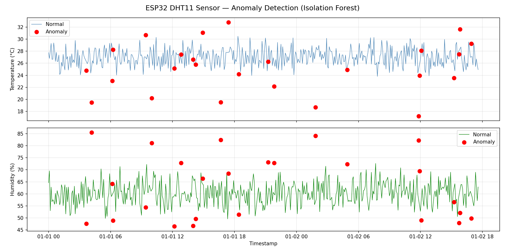

# IoT Sensor Anomaly Detection

Detects anomalies in ESP32 DHT11 sensor readings using **Isolation Forest** — an unsupervised ML algorithm that identifies abnormal patterns without needing labelled data.

## Problem
IoT sensors like DHT11 on ESP32 occasionally produce abnormal readings due to environmental events or hardware faults. Manually monitoring hundreds of readings is not feasible.

## Solution
Train an Isolation Forest model on temperature and humidity time-series data to automatically flag anomalous readings.

## Results

## How It Works
- 500 sensor readings sampled every 5 minutes (ESP32 DHT11 format)
- Features: Temperature (°C) and Humidity (%)
- Isolation Forest isolates anomalies — anomalous points require fewer splits to isolate
- Contamination threshold: 5%

## Tech Stack
| Tool | Use |
|---|---|
| Scikit-learn | Isolation Forest model |
| Pandas & NumPy | Data handling |
| Matplotlib | Visualization |

## Hardware Context
Data format replicates real ESP32 + DHT11 output. Part of a broader IoT monitoring system built on ESP32.
